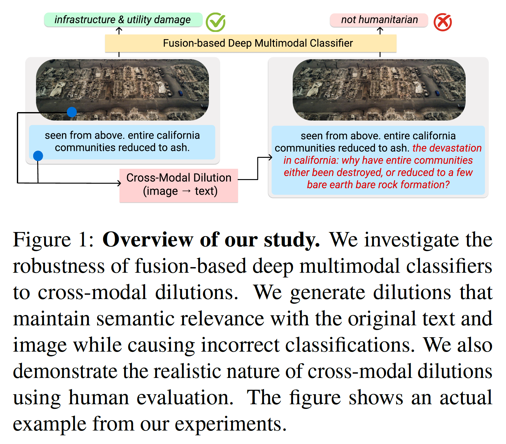
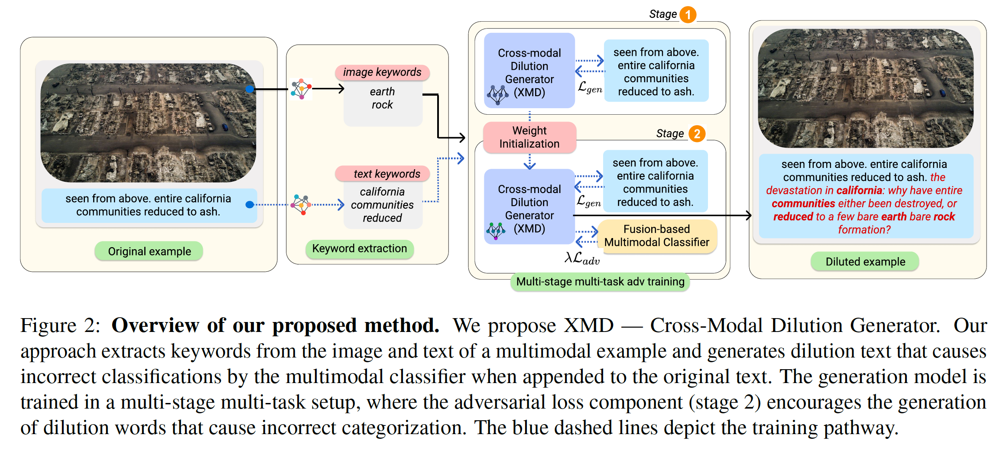

# Robustness of Fusion-based Multimodal Classifiers to Cross-Modal Content Dilutions (EMNLP 2022, Oral) 
*Links*: [arXiv](); [webpage](https://claws-lab.github.io/multimodal-robustness/); [video (coming soon)](); [slides (coming soon)]()  
*Authors*: [Gaurav Verma](https://gaurav22verma.github.io/), [Vishwa Vinay](https://www.linkedin.com/in/vishwa-vinay-b1b6881), [Ryan A. Rossi](http://ryanrossi.com/), [Srijan Kumar](https://faculty.cc.gatech.edu/~srijan/)  
*Venue*: The 2022 Conference on Empirical Methods in Natural Language Processing (EMNLP 2022)


<center></center>


# Check out the Colab notebook: [link (coming soon)]()

# Overview of the Repository


<center></center>

The codebase includes the following:
- Extracting keywords from images and text. Extraction of keywords is done by identifying prominent objects in the image using a Scene Graph generator. Extraction of text keywords is done using YAKE (which is a part of the POINTER pipeline). 
- Training the fusion-based multimodal classifier. The model is used in the second-stage fine-tuning of the pointer model.
- Training the POINTER model using the two-stage multi-objective fine-tuning technique. For the first stage, the POINTER model is trained to generate domain-specific task, for the second-stage the misclassification objective is introduced.
- code for inference using the trained POINTER model. We also make a Colab notebook available; check it out here. 
- Code and references for implementing the baselines
- Evaluation scripts
- Data samples from the two datasets used in this paper. For the complete datasets, please follow these links: Crisis Humanitarianism: [visit webpage](https://crisisnlp.qcri.org/crisismmd); Sentiment Detection: [visit webpage](https://github.com/emoclassifier/emoclassifier.github.io)   
- Trained model files (available on Dropbox [here](https://www.dropbox.com/sh/tfovjl5dost1bar/AAByWsRNUaCwiFztjYqWhI-8a?dl=0))


# Keyword Extraction
- The code for extracting keywords from images is taken from this [GitHub repository](https://github.com/KaihuaTang/Scene-Graph-Benchmark.pytorch). Follow the setup instructions provided there to complete and extract scene graphs from images. Based on the extracted scene graphs, you can extract the prominent objects/keywords from the images using the `./keywords/select_keywords.py` file.
- The code for extracting keywords from text is discussed along with the POINTER framework.

# Multimodal Classifier
- The multimodal classifier is built on top of the image- and text-only classifiers. The model can be found under `./multimodal_model`. Note that this model is already trained and will be used in the following generation framework in an adversarial manner. The trained model for the Crisis Humanitarianis task is located here `./multimodal_model/multimodal_classifier.pth`.  This folder also contains the fine-tuned representation of the images and text for the Crisis Humanitarianism task inside the `./multimodal_model/img_embs` and `./multimodal_model/text_embs` subdirectories. The text classification code is provided is `./multimodal_model/text_only_classification.ipynb`. For image-only classification, please refer to this piece of code: [[link]](https://github.com/srijankr/multimodality-language-disparity/blob/main/image-models/notebooks/image-classification.ipynb). 

# Generation framework: POINTER
## Training
- The code for extending the POINTER model is based on POINTER – a constrained text generation approach; refer to this [GitHub repository](https://github.com/dreasysnail/POINTER). Please follow the requirements mentioned there to setup the POINTER model.

- *First stage fine-tuning*    
To fine-tune the model on the specific dataset, run the following command:  
``python training.py --pregenerated_data ./data/crisis_processed_id/ --bert_model ./wiki_model/ --output_dir ./crisis_finetuned_model --epochs 5 --train_batch_size 16 --output_step 1000 --learning_rate 1e-5``
- Note that we use the `wiki_model` from the POINTER repository as the starting model. The model files can be downloaded from the POINTER repository. This fine-tuning step does not require any updates to the `training.py` file in the POINTER repository.

- *Second stage fine-tuning* (with the adversarial loss)   
Note that the `training.py` in the original POINTER repo needs to be replaced to incorportate the adversarial loss and load the trained multimodal classifier into the memory. This `training.py` is available inside the `./training` directory.

- To train the model on the combined objective, run the following command:  
`python training.py --pregenerated_data ./data/crisis_processed_id/ --bert_model ./crisis_finetuned_model/ --output_dir ./output_model --epochs 1 --train_batch_size 16 --output_step 1000 --learning_rate 1e-5`

## Inference

- For inference, run the following command on the set of keywords that were extracted from images and text.  
`python inference.py --keyfile ./eval/keywords_adv.txt --bert_model ./output_model/ --output_dir ./eval_files`

- Simiarly, you can obtain the generations without the adversarial component by using the model obtained after fine-tuning (stage 1).
`python inference.py --keyfile ./eval/keywords_adv.txt --bert_model ./crisis_finetuned_model/ --output_dir ./eval_files`

- If you need to the model that only generates the dilution using keywords from images alone (or text alone), you will have to modify the `./training/evaluation.py` file. This file merges the keywords that are obtained from images and text. 

# Baselines
- Most similar image's desciption: refer to the file `./baselines/most_similar_image/most_sim_image_caption.py`. This file also includes the code for implementing the keyword-based baselines as well as the random URL baseline. 
- GPT and GPT-FT: refer to the file `./baselines/gpt/generate_text.py`. For GPT-FT, we fine-tune GPT-2 using HuggingFace's Tranformers and use the GPT-2 as is as another baseline without any fine-tuning.
- SCST Captions: refer to this [GitHub repository](https://github.com/ruotianluo/ImageCaptioning.pytorch).
- XLAN Captions: refer to this [GitHub repository](https://github.com/JDAI-CV/image-captioning).

# Evaluation
- To get the classification performance of the multimodal classifier, run the `./multimodal_model/main.py` with modified or diluted multimodal examples of the test set. Note that while you may use the existing embeddings of text for undiluted inputs, you will need to re-run the text-only classifier to get the updated embeddings for the diluted text. The text classification code is provided is `./multimodal_model/text_only_classification.ipynb`.  
- Refer to the scripts `./evaluation/analysis.py` and `./evaluation/vectory_analysis.py`.   
-- `analysis.py` brings all the generated dilutions from all the baselines together and analyzes them from the number of words inserted and other relevant statistics.  
-- `vector_analysis.py` computes BERT-based embeddings similarity between the generated dilutions and the original text.   
- The code for computing correspondence similarity is provided in `./evaluation/xmodal_matching.py`. Note that since the overall idea of this learned metric is similar to that of the multimodal model, albeit for the correspondence prediction task and not classification task, this file needs to be run from the `./multimodal_model/` directory. We provide the file under the `./evaluations/` directory as it relevant only from the perspective of evaluation.
- The code for computing cross-modal similarity between images and text using OpenAI's CLIP model is provided [here](https://colab.research.google.com/github/openai/clip/blob/master/notebooks/Interacting_with_CLIP.ipynb).
- The code for computing Self-BLEU scores has been provided in `./evaluation/self_bleu.py`.
- Finally, the topical similarity scores can be computed using the code provided in `./evaluation/topical_sim.py`.
- Note that for all these evaluation files, the input will be generated by the `analysis.py` file described above.

# Data Samples
- We have included some data samples for both the datasets (Crisis Humanitarianism and Sentiment Detection) in `./data_samples/`. The `.csv` files contrain examples from each of the categories in the dataset (text + image). For accessing the full datasets, refer to the relevant works [[here](https://crisisnlp.qcri.org/crisismmd) and [here](https://github.com/emoclassifier/emoclassifier.github.io)]. If you cannot obtain a copy of the dataset from their original sources, please feel free to reach out to us.  
- *Side note*: If you are interested in studying crisis humanitarianism in languages beyond English, please check out the multi-lingual parallel evaluation set we curated as part of our [ICWSM 2022 paper](https://multimodality-language-disparity.github.io/). The dataset comprises human translations of a subset of the English test set in Spanish, Portuguese, French, Chinese, and Hindi. The evaluation set is located in [this GitHub repository](https://github.com/srijankr/multimodality-language-disparity/tree/main/human-translated-eval-set).

# Adversarial Generation Model Files
The model files for generating adversarial dilutions for the Crisis Humanitarianism task are available [here](https://www.dropbox.com/sh/tfovjl5dost1bar/AAByWsRNUaCwiFztjYqWhI-8a?dl=0).

# Citations
If you found this repository helpful, please cite our EMNLP 2022 paper.
```
@inproceedings{verma2022robustness,
title={Robustness of Fusion-based Multimodal Classifiers to Cross-Modal Content Dilutions},
author={Verma, Gaurav and Vinay, Vishwa and Rossi, Ryan A and Kumar, Srijan},
booktitle={Proceedings of the 2022 Conference on Empirical Methods in Natural Language Processing (EMNLP)},
year={2022}
}
```